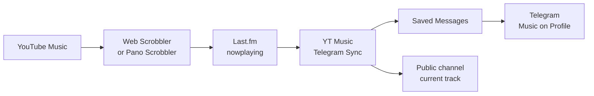

<p align="right">English | <a href="README_RU.md">Русский</a></p>

<p align="center">
  
</p>

<h1 align="center">YT Music → Last.fm → Telegram</h1>

<p align="center">
  A local Windows application that displays your current music<br>
  in <strong>Music on Profile</strong> or a temporary Telegram personal channel.
</p>

<p align="center">
  
  
  
  
  
</p>

The application reads `nowplaying` from Last.fm, creates a Telegram audio file with proper metadata, and either adds it to your profile music or temporarily publishes it in a selected personal channel. Playback can originate from YouTube Music in a browser, an Android app, or any other player capable of scrobbling to Last.fm.

> [!IMPORTANT]
> This is not a Telegram Bot API bot. Bot API cannot modify a user's profile music, so the application signs in locally as your Telegram client through Telethon. Never share your `telegram.session` file.

## How it works



The application:

- reads only active `nowplaying`, not the most recent completed scrobble;
- filters short `nowplaying` outages through multiple confirmation checks;
- runs in the system tray without a taskbar window;
- publishes either a placeholder or a real MP3 with title, artist, and artwork;
- maintains a bounded LRU cache and restores it after a restart;
- removes tracks added during the listening session after playback stops;
- can set a Telegram Premium emoji status while `nowplaying` is active and restore the previous one;
- can temporarily assign a selected public channel to the profile, publish only the current track there, and restore the previous personal channel;
- provides Russian and English localization for the setup window and system tray;
- lets you disable tray notifications or keep them visible without sound;
- supports pause, manual synchronization, and cleanup from the tray menu;
- never stores your Last.fm password, Telegram login code, or Telegram 2FA password.

## Quick start

### Requirements

- Windows 10 or 11;
- Python 3.11 or newer; Python 3.12 x64 is recommended;
- Last.fm and Telegram accounts;
- a [Last.fm API key](https://www.last.fm/api/account/create);
- Telegram `api_id` and `api_hash` from [my.telegram.org/apps](https://my.telegram.org/apps);
- a scrobbler that sends YouTube Music playback to Last.fm;
- FFmpeg only for the `mixed` and `audio` modes.
- Telegram Premium only for automatic emoji status changes.
- an owned or administered public broadcast channel for channel mode; Telegram API does not accept groups or supergroups.

### Installation

Download the repository, open PowerShell in its directory, and run:

```powershell
Set-ExecutionPolicy -Scope Process Bypass
.\setup.ps1
```

The script locates a compatible installed Python, creates `.venv`, installs the application, and opens the setup wizard. If Python is missing and `winget` is available, it offers to install Python 3.12. Then:

1. Select **Русский** or **English** in the upper-right corner.
2. Enter your Last.fm username and API key.
3. Select **Test Last.fm**.
4. Enter your Telegram API ID, API hash, and phone number in international format.
5. Select **Send code**, then enter the Telegram login code.
6. If 2FA is enabled, enter its password — it is used only for this sign-in.
7. Select the music destination: **Profile**, **Personal channel**, or **Profile + channel**.
8. Optionally select an emoji status—it works in either mode. For channel mode, also click **Select…** next to the channel and follow the Telegram prompt.
9. Review the remaining options, select an audio mode and notification preferences, then click **Save**.

During initial installation, the window closes after saving; then open `start_tray.vbs`. When settings are opened from the tray, saving automatically restarts the application with the new configuration. Closing with the window's X button also saves valid changes; **Cancel** closes without saving.

> [!NOTE]
> The API requires your Last.fm username, not your email address. The username is part of your profile URL: `last.fm/user/USERNAME`.

## Sending YouTube Music to Last.fm

In a browser, install [Web Scrobbler](https://webscrobbler.com/), connect it to Last.fm, and allow it to run on `music.youtube.com`.

On Android, you can use the official Last.fm app or Pano Scrobbler. External scrobbling from the native YouTube Music app is limited on iOS; a practical alternative is YouTube Music in Safari with a compatible scrobbler.

Before starting synchronization, open your Last.fm profile and verify that the track is marked **Scrobbling now**.

## Audio modes

| Mode | Behavior | FFmpeg | Best for |
|---|---|:---:|---|
| `placeholder` | Immediately publishes a short silent MP3 with metadata and artwork | No | The fastest and most reliable mode |
| `mixed` | Publishes a placeholder immediately, then replaces it with discovered audio in the background | Yes | The best balance between speed and real audio |
| `audio` | Downloads audio first and publishes only after it is ready | Yes | When a placeholder must never be shown |

Install FFmpeg for `mixed` and `audio`:

```powershell
winget install --id Gyan.FFmpeg -e
ffmpeg -version
```

Audio is located through `yt-dlp` using the artist and title. Last.fm does not provide the original YouTube `videoId`, so the result may occasionally be another version, a remix, or a live recording. The application falls back to a placeholder when audio cannot be found.

> [!WARNING]
> Downloading and republishing audio may be governed by the service terms and copyright law in your jurisdiction. You are responsible for how you use the `mixed` and `audio` modes.

## Running the application

### System tray

Open `start_tray.vbs`. The application starts through `pythonw.exe`, without a console or taskbar button. Its icon may be hidden behind the `^` arrow in the notification area.

The tray menu lets you:

- pause or resume synchronization;
- request an immediate Last.fm check;
- remove profile music created by the application;
- remove the application's current channel post;
- edit settings;
- open the log or application data directory;
- restart or exit the application.

### Diagnostic console

```text
start_console.bat
```

Press `Ctrl+C` to stop it.

### Start with Windows

1. Press `Win+R`.
2. Enter `shell:startup`.
3. Create a shortcut to `start_tray.vbs` in the opened directory.

## Synchronization settings

| Option | Purpose |
|---|---|
| Language | Switches the setup window immediately; after saving, the tray menu and notifications use the same language |
| Last.fm polling | Request interval; 5–10 seconds is recommended, 3 is the minimum |
| Checks before idle | Number of empty responses required to confirm playback has stopped; 3 is recommended |
| Profile tracks | Maximum LRU cache size |
| Parallel downloads | Number of background download workers used by `mixed` mode |
| Music destination | `Profile` saves tracks to Music on Profile; `Personal channel` publishes only the current track to the channel; `Profile + channel` does both without downloading twice |
| Now playing channel | ID of a public broadcast channel; **Select…** reads it from the Telegram profile settings |
| Emoji status while nowplaying | The checkbox enables automatic status changes; the selected custom emoji ID is retained while disabled |
| Remove music when idle | Removes all tracked session entries from the profile after a confirmed stop |
| Show system notifications | Enables track, error, cleanup, and settings notifications from the tray application |
| Play notification sound | Keeps notifications visible but sends them to Windows with the `NIIF_NOSOUND` flag when disabled |

Last.fm does not expose a dedicated `stop` event. Cleanup therefore happens after `nowplaying` disappears and the configured number of empty checks has completed.

The **Emoji status while nowplaying** checkbox explicitly enables or disables the feature without deleting the selected ID. The **Select…** button verifies Telegram Premium, remembers the current status, and asks you to set the desired ordinary emoji status in Telegram. After reading its ID, the wizard immediately restores the original status. During synchronization, the selected emoji is set for active `nowplaying` and the previous status is restored after confirmed idle, pause, or a normal application exit. If you manually change the status while listening, that change is preserved.

In **Personal channel** mode, the wizard similarly asks you to temporarily choose a channel through **Telegram → Edit Profile → Personal Channel**, reads its ID, and restores the original channel. During `nowplaying`, the application assigns the selected channel to the profile and keeps one current audio post there, deleting the previous post when the track changes. On confirmed idle, pause, or normal exit, the post is deleted and the previous personal channel is restored. Music is not added to Music on Profile and Saved Messages is not used. Emoji status can be enabled independently in this mode too. Manual personal-channel and emoji-status changes made while listening are preserved.

**Profile + channel** mode uses one prepared audio file for both destinations: tracks are retained in Music on Profile according to the LRU cache, while the channel keeps only the current post. On idle, the channel post is always deleted; profile music is removed only when **Remove profile music when now playing disappears** is enabled.

## Data and security

All user data is stored outside the repository:

```text
%APPDATA%\YTMusicTelegramSync\
├── config.json          # settings and API credentials
├── config.draft.json    # unfinished initial-setup draft
├── state.json           # messages created by the application
├── telegram.session     # authorized Telegram session
└── logs\app.log         # rotating application log
```

The Last.fm password is not required. Telegram login codes and 2FA passwords are never written to disk. The log filter redacts the Last.fm API key from HTTP errors.

API keys, hashes, and the phone number are masked by default in the setup window and can be revealed with **Show credentials**. Never publish:

- `telegram.session` or `*.session-journal`;
- `config.json` or `config.draft.json`;
- screenshots with revealed credentials;
- API keys, API hashes, phone numbers, or log fragments containing personal data.

These files are already excluded through `.gitignore`.

## Troubleshooting

<details>
<summary><strong>Last.fm has listening history, but Telegram is not updated</strong></summary>

Make sure the track has an active `nowplaying` status instead of merely appearing in history. Reconnect your scrobbler to Last.fm and verify its permission to run on `music.youtube.com`.
</details>

<details>
<summary><strong>Music remains in Telegram after pausing playback</strong></summary>

The application waits for `nowplaying` to disappear and for several empty responses. With default settings, cleanup takes about 15 seconds plus any delay introduced by the scrobbler itself.
</details>

<details>
<summary><strong>Mixed mode does not replace the placeholder</strong></summary>

Check `ffmpeg -version`, YouTube connectivity, and `%APPDATA%\YTMusicTelegramSync\logs\app.log`. If audio cannot be located, the placeholder intentionally remains in the profile.
</details>

<details>
<summary><strong>The Telegram session is no longer authorized</strong></summary>

Open **Settings** from the tray menu, request a new Telegram code, and sign in again. Saving the settings restarts the application automatically.
</details>

<details>
<summary><strong>The tray icon is missing</strong></summary>

Check the hidden icons behind the `^` arrow. If the process has exited, run `start_console.bat` and inspect the reported error.
</details>

<details>
<summary><strong>Setup reports that no suitable Python runtime was found</strong></summary>

Allow `setup.ps1` to install Python when prompted, or install it manually and rerun the script:

```powershell
winget install --id Python.Python.3.12 -e
```

If Python was installed manually, open a new PowerShell window before running `setup.ps1` again.
</details>

<details>
<summary><strong>The listening emoji remains after the application crashed</strong></summary>

The previous emoji status is kept in memory so that a manual status change from another Telegram client is never overwritten. A forced process termination can therefore prevent automatic restoration; clear or change the status in Telegram and restart the application normally.
</details>

<details>
<summary><strong>The music personal channel remains after a crash</strong></summary>

Like the emoji status, the previous personal channel is kept only in memory to avoid overwriting a manual change from another Telegram client. After a forced termination, restore the channel manually in your profile settings. The remaining audio post is removed after the next confirmed idle if the application is restarted in the same channel mode.
</details>

## Development

```powershell
py -3.12 -m venv .venv
.\.venv\Scripts\python.exe -m pip install -e ".[dev]"
.\.venv\Scripts\python.exe -m ruff check .
.\.venv\Scripts\python.exe -m mypy src
.\.venv\Scripts\python.exe -m unittest discover -s tests -v
```

The application version has a single source in `yt_music_telegram_sync.__version__` and is also shown by `--version`, in the setup window, and in the tray tooltip. To prepare and publish a release from a clean working tree:

```powershell
Set-ExecutionPolicy -Scope Process Bypass
.\release.ps1 -Version 1.2.0 -Push
```

Every successful push to `main` starts the release workflow and creates a prerelease with a unique tag such as `v1.1.0-build.5.1`. All checks run before the wheel and source ZIP are published.

Use the command above for a stable release: the script creates a release commit when needed, creates the stable `v1.2.0` tag, and pushes both. Pushing a stable tag also starts the release workflow, but publishes a regular GitHub Release instead of a prerelease. See [CONTRIBUTING.md](CONTRIBUTING.md) or [CONTRIBUTING_RU.md](CONTRIBUTING_RU.md).

Project structure:

```text
src/yt_music_telegram_sync/  application and CLI
tests/                       unit and regression tests
.github/workflows/           Windows CI for Python 3.11–3.14
setup.ps1                    installation and initial setup
release.ps1                  version, validation, tagging, and optional push
start_tray.vbs               silent system-tray launcher
start_console.bat            diagnostic launcher
```

See [CONTRIBUTING.md](CONTRIBUTING.md) for contribution guidelines.

## Origin and license

This project was inspired by [therepanic/spotify-telegram-sync](https://github.com/therepanic/spotify-telegram-sync), but uses Last.fm as a universal `nowplaying` source and focuses on a local Windows GUI/system-tray workflow.

The code is released into the public domain under the [Unlicense](LICENSE). This project is not affiliated with YouTube, Last.fm, Telegram, or any content rights holder.
