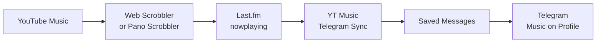

<p align="right">English | <a href="README_RU.md">Русский</a></p>

<p align="center">
  
</p>

<h1 align="center">YT Music → Last.fm → Telegram</h1>

<p align="center">
  A local Windows application that displays your current music<br>
  in the <strong>Music on Profile</strong> section of your Telegram profile.
</p>

<p align="center">
  
  
  
  
  
</p>

The application reads `nowplaying` from Last.fm, creates a Telegram audio file with proper metadata, and adds it to your profile music. Playback can originate from YouTube Music in a browser, an Android app, or any other player capable of scrobbling to Last.fm.

> [!IMPORTANT]
> This is not a Telegram Bot API bot. Bot API cannot modify a user's profile music, so the application signs in locally as your Telegram client through Telethon. Never share your `telegram.session` file.

## How it works



The application:

- reads only active `nowplaying`, not the most recent completed scrobble;
- filters short `nowplaying` outages through multiple confirmation checks;
- runs in the system tray without a taskbar window;
- publishes either a placeholder or a real MP3 with title, artist, and artwork;
- maintains a bounded LRU cache and restores it after a restart;
- removes tracks added during the listening session after playback stops;
- supports pause, manual synchronization, and cleanup from the tray menu;
- never stores your Last.fm password, Telegram login code, or Telegram 2FA password.

## Quick start

### Requirements

- Windows 10 or 11;
- Python 3.12 x64 — recommended;
- Last.fm and Telegram accounts;
- a [Last.fm API key](https://www.last.fm/api/account/create);
- Telegram `api_id` and `api_hash` from [my.telegram.org/apps](https://my.telegram.org/apps);
- a scrobbler that sends YouTube Music playback to Last.fm;
- FFmpeg only for the `mixed` and `audio` modes.

### Installation

Download the repository, open PowerShell in its directory, and run:

```powershell
Set-ExecutionPolicy -Scope Process Bypass
.\setup.ps1
```

The script creates `.venv`, installs the application, and opens the setup wizard. Then:

1. Enter your Last.fm username and API key.
2. Select **Check Last.fm**.
3. Enter your Telegram API ID, API hash, and phone number in international format.
4. Select **Send code**, then enter the Telegram login code.
5. If 2FA is enabled, enter its password — it is used only for this sign-in.
6. After a successful sign-in, review the remaining options, select an audio mode, and click **Save**.

During initial installation, the window closes after saving; then open `start_tray.vbs`. When settings are opened from the tray, saving automatically restarts the application with the new configuration. Closing with the window's X button also saves valid changes; **Cancel** closes without saving.

> [!NOTE]
> The API requires your Last.fm username, not your email address. The username is part of your profile URL: `last.fm/user/USERNAME`.

## Sending YouTube Music to Last.fm

In a browser, install [Web Scrobbler](https://webscrobbler.com/), connect it to Last.fm, and allow it to run on `music.youtube.com`.

On Android, you can use the official Last.fm app or Pano Scrobbler. External scrobbling from the native YouTube Music app is limited on iOS; a practical alternative is YouTube Music in Safari with a compatible scrobbler.

Before starting synchronization, open your Last.fm profile and verify that the track is marked **Scrobbling now**.

## Audio modes

| Mode | Behavior | FFmpeg | Best for |
|---|---|:---:|---|
| `placeholder` | Immediately publishes a short silent MP3 with metadata and artwork | No | The fastest and most reliable mode |
| `mixed` | Publishes a placeholder immediately, then replaces it with discovered audio in the background | Yes | The best balance between speed and real audio |
| `audio` | Downloads audio first and publishes only after it is ready | Yes | When a placeholder must never be shown |

Install FFmpeg for `mixed` and `audio`:

```powershell
winget install --id Gyan.FFmpeg -e
ffmpeg -version
```

Audio is located through `yt-dlp` using the artist and title. Last.fm does not provide the original YouTube `videoId`, so the result may occasionally be another version, a remix, or a live recording. The application falls back to a placeholder when audio cannot be found.

> [!WARNING]
> Downloading and republishing audio may be governed by the service terms and copyright law in your jurisdiction. You are responsible for how you use the `mixed` and `audio` modes.

## Running the application

### System tray

Open `start_tray.vbs`. The application starts through `pythonw.exe`, without a console or taskbar button. Its icon may be hidden behind the `^` arrow in the notification area.

The tray menu lets you:

- pause or resume synchronization;
- request an immediate Last.fm check;
- remove profile music created by the application;
- edit settings;
- open the log or application data directory;
- restart or exit the application.

### Diagnostic console

```text
start_console.bat
```

Press `Ctrl+C` to stop it.

### Start with Windows

1. Press `Win+R`.
2. Enter `shell:startup`.
3. Create a shortcut to `start_tray.vbs` in the opened directory.

## Synchronization settings

| Option | Purpose |
|---|---|
| Last.fm polling | Request interval; 5–10 seconds is recommended, 3 is the minimum |
| Checks before idle | Number of empty responses required to confirm playback has stopped; 3 is recommended |
| Profile tracks | Maximum LRU cache size |
| Parallel downloads | Number of background download workers used by `mixed` mode |
| Remove music when idle | Removes all tracked session entries from the profile after a confirmed stop |

Last.fm does not expose a dedicated `stop` event. Cleanup therefore happens after `nowplaying` disappears and the configured number of empty checks has completed.

## Data and security

All user data is stored outside the repository:

```text
%APPDATA%\YTMusicTelegramSync\
├── config.json          # settings and API credentials
├── config.draft.json    # unfinished initial-setup draft
├── state.json           # messages created by the application
├── telegram.session     # authorized Telegram session
└── logs\app.log         # rotating application log
```

The Last.fm password is not required. Telegram login codes and 2FA passwords are never written to disk. The log filter redacts the Last.fm API key from HTTP errors.

Never publish:

- `telegram.session` or `*.session-journal`;
- `config.json` or `config.draft.json`;
- API keys, API hashes, phone numbers, or log fragments containing personal data.

These files are already excluded through `.gitignore`.

## Troubleshooting

<details>
<summary><strong>Last.fm has listening history, but Telegram is not updated</strong></summary>

Make sure the track has an active `nowplaying` status instead of merely appearing in history. Reconnect your scrobbler to Last.fm and verify its permission to run on `music.youtube.com`.
</details>

<details>
<summary><strong>Music remains in Telegram after pausing playback</strong></summary>

The application waits for `nowplaying` to disappear and for several empty responses. With default settings, cleanup takes about 15 seconds plus any delay introduced by the scrobbler itself.
</details>

<details>
<summary><strong>Mixed mode does not replace the placeholder</strong></summary>

Check `ffmpeg -version`, YouTube connectivity, and `%APPDATA%\YTMusicTelegramSync\logs\app.log`. If audio cannot be located, the placeholder intentionally remains in the profile.
</details>

<details>
<summary><strong>The Telegram session is no longer authorized</strong></summary>

Open **Settings** from the tray menu, request a new Telegram code, and sign in again. Saving the settings restarts the application automatically.
</details>

<details>
<summary><strong>The tray icon is missing</strong></summary>

Check the hidden icons behind the `^` arrow. If the process has exited, run `start_console.bat` and inspect the reported error.
</details>

## Development

```powershell
py -3.12 -m venv .venv
.\.venv\Scripts\python.exe -m pip install -e ".[dev]"
.\.venv\Scripts\python.exe -m ruff check .
.\.venv\Scripts\python.exe -m mypy src
.\.venv\Scripts\python.exe -m unittest discover -s tests -v
```

Project structure:

```text
src/yt_music_telegram_sync/  application and CLI
tests/                       unit and regression tests
.github/workflows/           Windows CI for Python 3.11–3.13
setup.ps1                    installation and initial setup
start_tray.vbs               silent system-tray launcher
start_console.bat            diagnostic launcher
```

See [CONTRIBUTING.md](CONTRIBUTING.md) for contribution guidelines.

## Origin and license

This project was inspired by [therepanic/spotify-telegram-sync](https://github.com/therepanic/spotify-telegram-sync), but uses Last.fm as a universal `nowplaying` source and focuses on a local Windows GUI/system-tray workflow.

The code is released into the public domain under the [Unlicense](LICENSE). This project is not affiliated with YouTube, Last.fm, Telegram, or any content rights holder.
