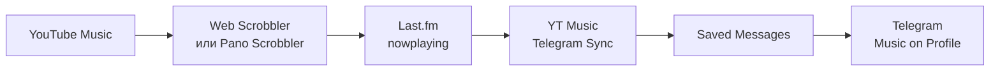

<p align="right"><a href="README.md">English</a> | Русский</p>

<p align="center">
  
</p>

<h1 align="center">YT Music → Last.fm → Telegram</h1>

<p align="center">
  Локальное Windows-приложение, которое показывает текущую музыку<br>
  в разделе <strong>Music on Profile</strong> вашего Telegram-профиля.
</p>

<p align="center">
  
  
  
  
  
</p>

Приложение получает `nowplaying` из Last.fm, создаёт Telegram-аудио с корректными метаданными и добавляет его в музыку профиля. Источником прослушивания может быть YouTube Music в браузере, Android-приложение или любой проигрыватель со скробблингом в Last.fm.

> [!IMPORTANT]
> Это не Telegram-бот. Bot API не умеет изменять музыку пользовательского профиля, поэтому приложение локально авторизуется как ваш Telegram-клиент через Telethon. Никому не передавайте файл `telegram.session`.

## Как это работает



Приложение:

- читает только активный `nowplaying`, а не последний завершённый scrobble;
- фильтрует кратковременные пропадания статуса несколькими проверками;
- работает в системном трее без окна на панели задач;
- публикует placeholder либо настоящий MP3 с названием, исполнителем и обложкой;
- хранит ограниченный LRU-кэш и восстанавливает его после перезапуска;
- очищает добавленные за сессию треки после остановки прослушивания;
- поддерживает паузу, ручную синхронизацию и очистку из меню трея;
- не хранит пароль Last.fm, код Telegram и пароль Telegram 2FA.

## Быстрый старт

### Требования

- Windows 10 или 11;
- Python 3.12 x64 — рекомендуемая версия;
- аккаунты [Last.fm](https://www.last.fm/) и Telegram;
- [Last.fm API key](https://www.last.fm/api/account/create);
- Telegram `api_id` и `api_hash` с [my.telegram.org/apps](https://my.telegram.org/apps);
- скробблер для передачи YouTube Music в Last.fm;
- FFmpeg только для режимов `mixed` и `audio`.

### Установка

Скачайте репозиторий, откройте PowerShell в его каталоге и выполните:

```powershell
Set-ExecutionPolicy -Scope Process Bypass
.\setup.ps1
```

Скрипт создаст `.venv`, установит приложение и откроет мастер настройки. Дальше:

1. Введите Last.fm username и API key.
2. Нажмите **Проверить Last.fm**.
3. Введите Telegram API ID, API hash и телефон в международном формате.
4. Нажмите **Отправить код**, затем введите код Telegram.
5. Если включена 2FA, введите её пароль — он используется только для входа.
6. После успешного входа проверьте остальные параметры, выберите режим аудио и нажмите **Сохранить**.

При первой установке окно закроется — после этого откройте `start_tray.vbs`. Если настройки были открыты из трея, после сохранения приложение автоматически перезапустится с новым конфигом. Крестик также сохраняет валидные изменения; **Отмена** закрывает окно без сохранения.

> [!NOTE]
> Для API требуется Last.fm username, а не email. Username виден в адресе профиля: `last.fm/user/USERNAME`.

## Передача YouTube Music в Last.fm

В браузере установите [Web Scrobbler](https://webscrobbler.com/), подключите Last.fm и разрешите работу на `music.youtube.com`.

На Android можно использовать официальное приложение Last.fm или Pano Scrobbler. На iOS внешний скробблинг из штатного YouTube Music ограничен; практический вариант — YouTube Music в Safari с совместимым скробблером.

Перед запуском синхронизации откройте свой профиль Last.fm и убедитесь, что рядом с треком отображается **Scrobbling now**.

## Режимы аудио

| Режим | Поведение | FFmpeg | Когда выбирать |
|---|---|:---:|---|
| `placeholder` | Мгновенно публикует короткий беззвучный MP3 с метаданными и обложкой | Нет | Самый быстрый и надёжный режим |
| `mixed` | Сразу публикует placeholder, затем в фоне заменяет его найденным аудио | Да | Лучший баланс скорости и настоящего звука |
| `audio` | Сначала скачивает аудио и только после этого публикует трек | Да | Когда placeholder вообще не нужен |

Для `mixed` и `audio` установите FFmpeg:

```powershell
winget install --id Gyan.FFmpeg -e
ffmpeg -version
```

Аудио ищется через `yt-dlp` по исполнителю и названию. Last.fm не передаёт исходный YouTube `videoId`, поэтому иногда может быть выбрана другая версия, ремикс или концертная запись. При ошибке поиска приложение использует placeholder.

> [!WARNING]
> Скачивание и повторная публикация аудио могут регулироваться условиями сервиса и авторским правом вашей юрисдикции. Пользователь самостоятельно отвечает за использование режимов `mixed` и `audio`.

## Запуск

### Системный трей

Откройте `start_tray.vbs`. Приложение запустится через `pythonw.exe`: без консоли и без кнопки на панели задач. Значок может находиться за стрелкой `^` в области уведомлений.

Из меню трея можно:

- приостановить или возобновить синхронизацию;
- немедленно проверить Last.fm;
- очистить созданную приложением музыку профиля;
- изменить настройки;
- открыть журнал или каталог данных;
- перезапустить или завершить приложение.

### Диагностическая консоль

```text
start_console.bat
```

Остановка — `Ctrl+C`.

### Автозапуск Windows

1. Нажмите `Win+R`.
2. Введите `shell:startup`.
3. Создайте в открывшейся папке ярлык на `start_tray.vbs`.

## Настройки синхронизации

| Параметр | Назначение |
|---|---|
| Опрос Last.fm | Интервал запросов; рекомендуется 5–10 секунд, минимум — 3 |
| Проверок перед idle | Число пустых ответов перед подтверждением остановки; рекомендуется 3 |
| Треков в профиле | Максимальный размер LRU-кэша |
| Параллельных загрузок | Число фоновых загрузчиков для режима `mixed` |
| Удалять музыку при idle | После подтверждённой остановки снимает с профиля все отслеживаемые треки сессии |

Last.fm не предоставляет отдельное событие `stop`, поэтому очистка происходит после исчезновения `nowplaying` и заданного количества пустых проверок.

## Данные и безопасность

Все пользовательские данные хранятся вне репозитория:

```text
%APPDATA%\YTMusicTelegramSync\
├── config.json          # настройки и API-реквизиты
├── config.draft.json    # черновик незавершённой первичной настройки
├── state.json           # сообщения, созданные приложением
├── telegram.session     # авторизованная Telegram-сессия
└── logs\app.log         # ротируемый журнал
```

Пароль Last.fm не нужен. Код Telegram и пароль 2FA не записываются. Фильтр журнала скрывает Last.fm API key из ошибок HTTP.

Никогда не публикуйте:

- `telegram.session` и `*.session-journal`;
- `config.json` и `config.draft.json`;
- API key, API hash, номер телефона и фрагменты журнала с персональными данными.

Эти файлы уже исключены через `.gitignore`.

## Решение проблем

<details>
<summary><strong>Last.fm показывает историю, но Telegram не обновляется</strong></summary>

Убедитесь, что трек имеет активный статус `nowplaying`, а не только появился в истории. Переподключите скробблер к Last.fm и проверьте разрешение для `music.youtube.com`.
</details>

<details>
<summary><strong>После паузы музыка остаётся в Telegram</strong></summary>

Приложение ждёт исчезновения `nowplaying` и несколько пустых ответов. При стандартных настройках очистка занимает около 15 секунд плюс возможная задержка самого скробблера.
</details>

<details>
<summary><strong>Режим mixed не заменяет placeholder</strong></summary>

Проверьте `ffmpeg -version`, доступ к YouTube и `%APPDATA%\YTMusicTelegramSync\logs\app.log`. Если аудио найти не удалось, placeholder намеренно остаётся в профиле.
</details>

<details>
<summary><strong>Telegram-сессия больше не авторизована</strong></summary>

Откройте **Настройки** из меню трея, повторно запросите код и выполните вход. После сохранения приложение перезапустится автоматически.
</details>

<details>
<summary><strong>Значка нет в трее</strong></summary>

Проверьте скрытые значки под стрелкой `^`. Если процесс завершился, запустите `start_console.bat` и посмотрите сообщение об ошибке.
</details>

## Разработка

```powershell
py -3.12 -m venv .venv
.\.venv\Scripts\python.exe -m pip install -e ".[dev]"
.\.venv\Scripts\python.exe -m ruff check .
.\.venv\Scripts\python.exe -m mypy src
.\.venv\Scripts\python.exe -m unittest discover -s tests -v
```

Структура проекта:

```text
src/yt_music_telegram_sync/  приложение и CLI
tests/                       модульные и регрессионные тесты
.github/workflows/           Windows CI для Python 3.11–3.13
setup.ps1                    установка и первичная настройка
start_tray.vbs               тихий запуск в системном трее
start_console.bat            диагностический запуск
```

Правила для изменений описаны в [CONTRIBUTING.md](CONTRIBUTING.md).

## Происхождение и лицензия

Проект вдохновлён [therepanic/spotify-telegram-sync](https://github.com/therepanic/spotify-telegram-sync), но использует Last.fm как универсальный источник `nowplaying` и ориентирован на локальный Windows GUI/tray-сценарий.

Код выпущен в общественное достояние на условиях [Unlicense](LICENSE). Проект не связан с YouTube, Last.fm, Telegram или правообладателями контента.
